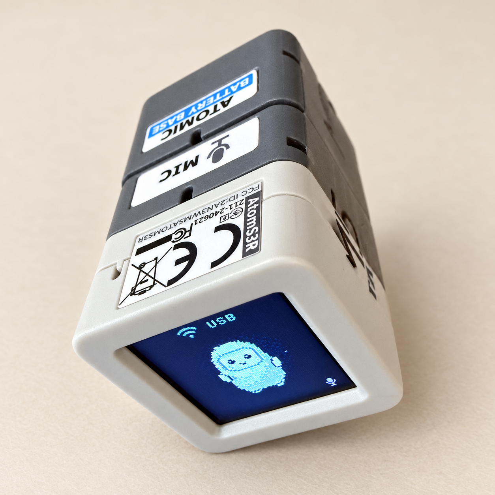
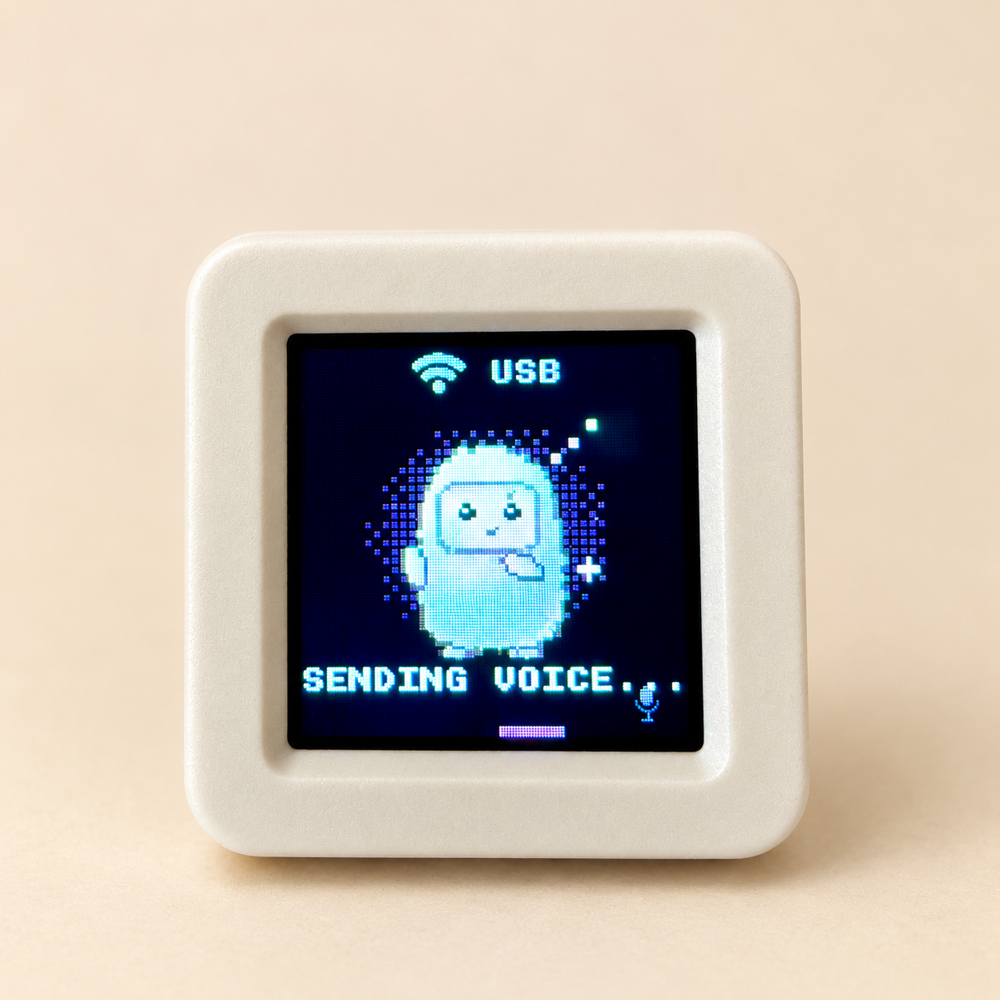

# ATOMS3R Muse Firmware

**English** | [简体中文](readme.CN.md)

<p align="center">
  
</p>

Community firmware for **M5Stack ATOMS3R + Atomic Echo Base**, with Muse chat,
MiniMax streaming text-to-speech, voice selection saved on the device, an optional
Shadowsocks 2022 TCP proxy, and 128×128 image display without a public upload.

This adaptation is based on the
[Meta Muse Gadget SDK](https://github.com/facebookincubator/muse-gadget-sdk).
The tested hardware is an ATOMS3R with 8 MB flash and 8 MB PSRAM, paired with
an Atomic Echo Base. The build helper targets this combination. Other boards
supported by the upstream SDK have not been validated in this project.

## Features

- Muse App pairing, Wi-Fi connectivity, push-to-talk input, and on-screen captions.
- MiniMax streaming text-to-speech: playback starts as audio arrives, with sentence-by-sentence processing that handles blank lines and multiple paragraphs.
- Voice selection through the USB serial console, saved across restarts without recompiling.
- Optional Shadowsocks 2022 routing for Muse connections, MiniMax speech, and HTTPS image downloads, with TLS certificate and hostname verification.
- Image requests from the ATOMS3R instruct Muse to export a 128×128 square image and send it as base64 through the encrypted device control connection. This avoids a public upload; successful delivery depends on Muse completing the export and device command.
- PNG and baseline JPEG display. Inline images must be exactly 128×128 pixels; WebP, GIF, and progressive JPEG are not supported.

## Device photos

<p align="center">
  
  
</p>

<p align="center"><em>Assembled device and voice-message screen.</em></p>

The Atomic Battery Base shown in the left photo is optional.

## Quick start

Install Python 3, Git, and **ESP-IDF v6.0.1**, then activate the ESP-IDF environment.
You also need a Muse App account, an ATOMS3R with Atomic Echo Base, and a
USB data cable. MiniMax speech requires a MiniMax API key.
The first build downloads dependencies through IDF Component Manager.

1. Clone this repository and copy `config/example.json` to `config/local.json` at the repository root.
2. Edit `config/local.json` and enter your own Muse SDK token.
3. To enable speech, set `minimax.enabled` to `true` and provide your API key. To enable the proxy, enter your node settings and set `proxy.enabled` to `true`.
4. Build and flash from a terminal with ESP-IDF activated.

Windows PowerShell:

```powershell
git clone https://github.com/rlog/atoms3r-muse-firmware.git
Set-Location atoms3r-muse-firmware
Copy-Item config/example.json config/local.json
# Edit config/local.json, then activate your ESP-IDF v6.0.1 environment:
. C:/path/to/esp-idf/export.ps1
python tools/build.py
python tools/build.py --action flash --port COM5
```

Linux/macOS:

```sh
git clone https://github.com/rlog/atoms3r-muse-firmware.git
cd atoms3r-muse-firmware
cp config/example.json config/local.json
# After editing your private configuration:
. /path/to/esp-idf/export.sh
python tools/build.py
python tools/build.py --action flash --port /dev/ttyACM0
```

Replace the ESP-IDF path and serial port in the examples with your own.

In the Muse App, open Settings → Devices, enable Developer mode, and add your
MuseGadget device. Configure Wi-Fi and press the ATOMS3R's physical screen button
when prompted to confirm pairing.
Get your SDK token from [Muse Gadgets](https://gadgets.muse.ai/).

## Configuration

Your actual settings belong in `config/local.json`, which Git ignores.
The repository provides `config/example.json` without credentials.

| Setting | Purpose |
|---|---|
| `muse.sdk_token` | Your Muse Gadget SDK token, required to use Muse. It may be left empty for a build-only check. |
| `minimax.enabled` / `minimax.api_key` | Enable MiniMax text-to-speech and supply your API key; disabled by default. |
| `minimax.url` | The HTTPS speech endpoint. The example uses the China endpoint; international accounts should use their service endpoint. |
| `minimax.model` / `minimax.voice` | Speech model and default voice ID. A voice already saved on the device takes precedence. |
| `proxy.enabled` | Enable proxy routing; disabled by default. |
| `proxy.method` | Must be `2022-blake3-aes-128-gcm`. |
| `proxy.server` / `proxy.port` / `proxy.key` | Proxy server IPv4 address, server TCP port, and a base64-encoded 16-byte pre-shared key (PSK). |

The proxy supports the SS2022 method listed above and destination TCP port 443
only. It does not support VLESS/REALITY, subscription URLs, or UDP, and does not
route all device traffic. Use a compatible proxy server that permits the required
connections. The device also needs SNTP time synchronization for the proxy to work.

`tools/build.py` validates the JSON and generates the ignored
`esp32/config/sdkconfig.local`. It also updates the relevant settings in an
existing build directory, preventing an old ESP-IDF sdkconfig from overriding
new values. After changing credentials, node settings, or compiled defaults,
rebuild and flash without editing C/C++.
These are build-time settings: personal firmware binaries contain the configured
credentials and should not be published. Normal flashing preserves pairing,
Wi-Fi, and voice settings in nonvolatile storage (NVS); a full flash erase removes them.

The first build generates a private `esp32/dev_signing_key.pem` for OTA application
signing. Git ignores this file. Keep it so later OTA updates can use the same
signing key. Firmware signed with a new key can be installed over USB; an existing
firmware will not accept OTA images signed with a different key.
Application signature verification remains enabled. This project does not enable
hardware Secure Boot or burn eFuses.

Change the voice at runtime:

```text
>tts.voice=Chinese (Mandarin)_Cute_Spirit
>tts.voice
>tts.test
```

With MiniMax enabled, send these commands through a serial terminal at 115200
baud. Keep the leading `>` character. The new voice is used for subsequent speech
segments; an in-progress synthesis request keeps its original voice. Voice IDs
are validated by MiniMax when speech is requested. The Muse App has no custom
voice-selection menu for this firmware. The `>tts.test` command needs a working
Wi-Fi connection to MiniMax.

For implementation details, see [speech](esp32/components/muse/MINIMAX.md),
[proxy routing](esp32/components/muse/PROXY.md),
[images](esp32/components/muse/IMAGES.md), and the
[upstream ESP32 documentation](esp32/README.md).
Muse App may still request device-tool permissions under its own policy;
the base64 route removes the public-upload step.

## Validation and contributing

The full host test suite runs in a POSIX environment with a C/C++ compiler,
CMake, pkg-config, and the mbedTLS, libpng, and cJSON development packages
(`libmbedtls-dev`, `libpng-dev`, and `libcjson-dev` on Debian/Ubuntu).
Install the Python dependencies with `pip install -r requirements-dev.txt`
before running the tests below.

```sh
python -m unittest discover -s tests
python tools/check_secrets.py
# Build once to download cJSON and other dependencies, then run firmware host tests:
python -m unittest discover -s esp32/tests
```

The pairing cryptography test needs `IDF_PATH`; some tests are skipped when
their dependencies are unavailable.
CI builds all added features with the public `config/ci.json` fixture and runs
host tests and credential checks. Its address is in a documentation-only range
and its key is a public test key. Use your own server and key for an actual connection.

See [hardware validation](docs/VALIDATION.md),
[contribution guidelines](CONTRIBUTING.md), and
[security reporting](SECURITY.md). Some supporting documents are currently in Chinese.

## License

[Apache-2.0](LICENSE). See [NOTICE](NOTICE) for upstream attribution and community
changes, and [THIRD_PARTY_NOTICES.md](THIRD_PARTY_NOTICES.md) for dependency and
font licenses.
This is an independent community project and is not officially maintained by
Muse, Meta, MiniMax, or M5Stack.
